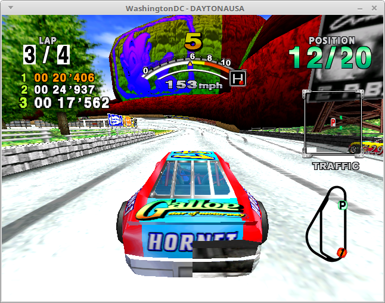

# WashingtonDC

WashingtonDC is an open-source SEGA Dreamcast emulator for Linux.  It's still at
an early stage of development; currently the only known games it can run are
the Dreamcast firmware, Crazy Taxi, Daytona USA, Power Stone and a handful of
homebrew programs.

## GALLERY



## COMPILING
```
mkdir build
cd build
cmake [OPTIONS] ..
make

Available options for the cmake generation are:

ENABLE_SH4_MMU=On(default)/Off - emulate the sh4's Memory Management Unit (MMU)
ENABLE_DEBUGGER=On(default)/Off - Enable the remote gdb backend
ENABLE_DIRECT_BOOT=On(default)/Off - Enable direct boot mode (optionally skip
                                     boot rom)
DBG_EXIT_ON_UNDEFINED_OPCODE=On/Off(default) - Bail out if the emulator hits an
                                               undefined opcode
INVARIANTS=On(default)/Off - runtime sanity checks that should never fail
DEEP_SYSCALL_TRACE=On/Off(default) - log system calls made by guest software.
```
## USAGE
```
./washingtondc -b dc_bios.bin -f dc_flash.bin [options] [-d IP.BIN] [-u 1ST_READ.BIN]

OPTIONS:
-b <bios_path> path to dreamcast boot ROM
-c enable development/debugging console access via TCP port 2000
-f <flash_path> path to dreamcast flash ROM image
-g enable remote GDB backend via TCP port 1999
-d enable direct boot <IP.BIN path>
-u skip IP.BIN and boot straight to 1ST_READ.BIN <1ST_READ.BIN>
-m <gdi path> path to .gdi file which will be mounted in the GD-ROM drive
-n don't do native memory inlining when the jit is enabled
-s path to dreamcast system call image (only needed for direct boot)
-t establish serial server over TCP port 1998
-h display this message and exit
-p disable the dynamic recompiler and enable the interpreter instead
-j disable the x86_64 backend and use the JIT IL interpreter instead
-x enable the x86_64 dynamic recompiler backend (this is enabled by default)

```
The emulator currently only supports one controller, and the controls cannot be
rebinded yet.  It must be controlled using a keyboard with a number pad.

The -b and -f options are mandatory because we need a firmware to boot.  To do a
direct-boot, the -s option is also needed to provide a system call image since
the firmware won't have had a chance to load one itself.

The -c command opens up a TCP on port 2000 that you can connect to via telnet to
control the emulator via a text-based command-line interface; this is the
closest thing to a UI that WashingtonDC has.

You can view online command documentation with the 'help' command.
'begin-execution' is the command to start the emulator.

The only games I know to work so far are Power Stone and Crazy Taxi.

```
    |============================|
    | keyboard   |     Dreamcast |
    |============================|
    | W          | UP    (D-PAD) |
    | S          | DOWN  (D-PAD) |
    | A          | LEFT  (D-PAD) |
    | D          | RIGHT (D-PAD) |
    | 2 (numpad) | A             |
    | 6 (numpad) | B             |
    | 4 (numpad) | X             |
    | 8 (numpad) | Y             |
    | Space      | Start         |
    |============================|

```
## EXAMPLES
load the firmware (dc_bios.bin) with no .gdi disc image mounted:
```
./washingtondc -b dc_bios.bin -f dc_flash.bin
```
load the firmware with a .gdi disc image mounted:
```
./washingtondc -b dc_bios.bin -f dc_flash.bin -m /path/to/disc.gdi
```
direct-boot a homebrew program (requires a system call table dump):
```
./washingtondc -b dc_bios.bin -f dc_flash.bin -s syscalls.bin -u 1st_read.bin
```
## LICENSE
WashingtonDC is licensed under the terms of the GNU GPLv3.  The terms of this
license can be found in COPYING.

WashingtonDC also makes use of several third-party libraries available under
various different licenses.

A copy of libpng version 1.6.34 is included in this source distribution with
some unnecessary components removed.  The license for this software can be
found at external/libpng/LICENSE.

A copy of zlib is included in this source distribution with some unnecessary
components removed and some minor modifications made to facilitate building on
certain platforms.  The license for this software can be found at
external/zlib/README.

WashingtonDC also makes use of the glfw library.  This is not included in this
source distribution, and is instead distributed using a git submodule.  The
license for this software can be found in external/glfw/LICENSE.md.

WashingtonDC also makes use of the libevent library.  This is not included in
this source distribution, and is instead automatically downloaded by the build
system as a tarball.  The license for this software can be found in the tarball
at libevent-2.1.8-stable/LICENSE.

WashingtonDC also makes use of version 2.1.0 of the glew library.  A copy of
this software with some unnecessary components removed is included in
external/glew.  The license for this software can be found at
external/glew/LICENSE.txt.

## CONTACT
You can reach me at my public-facing e-mail address, chimerasaurusrex@gmail.com.

I'm also @sbockers on twitter if you can tolerate my lame sense of humor.

WashingtonDC's official website (such as it is) can be found at http://snickerbockers.github.io.
