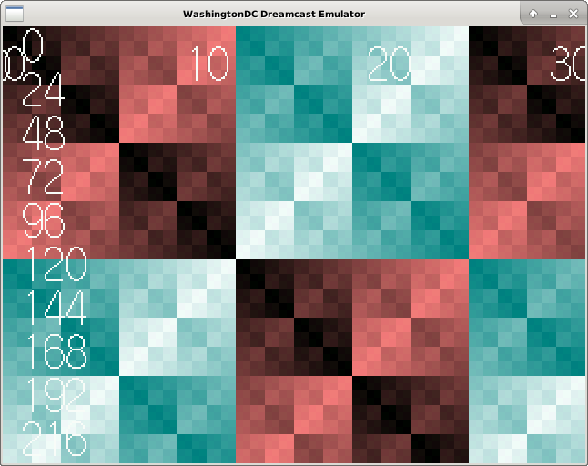

# WashingtonDC

WashingtonDC is an open-source SEGA Dreamcast emulator for Linux.  Currently
it's only capable of running a handful of homebrew programs because it is still
at an early stage of development.

## GALLERY
") 

*(the SEGA license statement in the above screenshot refers to a program running within WashingtonDC, not WashingtonDC itself)*

## COMPILING
```
mkdir build
cd build
cmake [OPTIONS] ..
make

Available options for the cmake generation are:

ENABLE_SH4_MMU=On(default)/Off - emulate the sh4's Memory Management Unit (MMU)
ENABLE_DEBUGGER=On(default)/Off - Enable the remote gdb backend
ENABLE_DIRECT_BOOT=On(default)/Off - Enable direct boot mode (optionally skip
                                     boot rom)
DBG_EXIT_ON_UNDEFINED_OPCODE=Of/Off(default) - Bail out if the emulator hits an
                                               undefined opcode
ENABLE_SERIAL_SERVER=On(default)/Off - Enable serial server over TCP port 1998
INVARIANTS=On(default)/Off - runtime sanity checks that should never fail
```
## USAGE
```
./washingtondc [options] [IP.BIN 1ST_READ.BIN]

OPTIONS:
-b <bios_path> path to dreamcast boot ROM
-f <flash_path> path to dreamcast flash ROM image
-g enable remote GDB backend via TCP port 1999
-d enable direct boot (skip BIOS)
-u skip IP.BIN and boot straight to 1ST_READ.BIN (only valid for direct boot)
-m <gdi path> path to .gdi file which will be mounted in the GD-ROM drive
-s path to dreamcast system call image (only needed for direct boot)
-t establish serial server over TCP port 1998
-h display this message and exit
```
