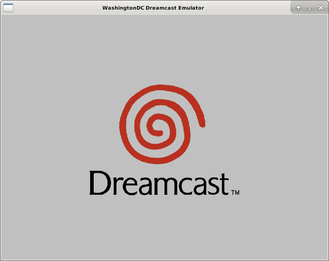
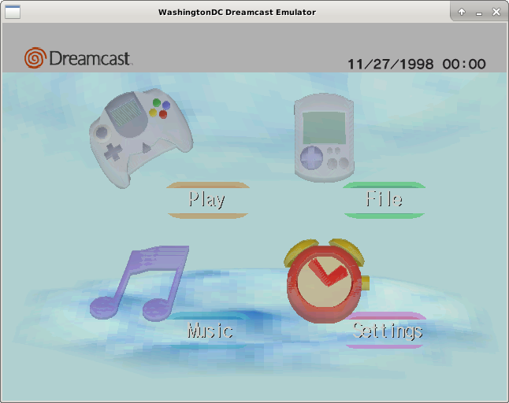

# WashingtonDC

WashingtonDC is an open-source SEGA Dreamcast emulator for Linux.  Currently
it's only capable of running the Dreamcast firmware and a handful of homebrew
programs because it is still at an early stage of development.

## GALLERY



## COMPILING
```
mkdir build
cd build
cmake [OPTIONS] ..
make

Available options for the cmake generation are:

ENABLE_SH4_MMU=On(default)/Off - emulate the sh4's Memory Management Unit (MMU)
ENABLE_DEBUGGER=On(default)/Off - Enable the remote gdb backend
ENABLE_DIRECT_BOOT=On(default)/Off - Enable direct boot mode (optionally skip
                                     boot rom)
DBG_EXIT_ON_UNDEFINED_OPCODE=Of/Off(default) - Bail out if the emulator hits an
                                               undefined opcode
INVARIANTS=On(default)/Off - runtime sanity checks that should never fail
DEEP_SYSCALL_TRACE=On/Off(default) - log system calls made by guest software.
```
## USAGE
```
./washingtondc [options] [IP.BIN 1ST_READ.BIN]

OPTIONS:
-b <bios_path> path to dreamcast boot ROM
-c enable development/debugging console access via TCP port 2000
-f <flash_path> path to dreamcast flash ROM image
-g enable remote GDB backend via TCP port 1999
-d enable direct boot (skip BIOS)
-u skip IP.BIN and boot straight to 1ST_READ.BIN (only valid for direct boot)
-m <gdi path> path to .gdi file which will be mounted in the GD-ROM drive
-s path to dreamcast system call image (only needed for direct boot)
-t establish serial server over TCP port 1998
-h display this message and exit

```
The emulator currently only supports one controller, and the controls cannot be
rebinded yet.  It must be controlled using a keyboard with a number pad.
```
    |============================|
    | keyboard   |     Dreamcast |
    |============================|
    | W          | UP    (D-PAD) |
    | S          | DOWN  (D-PAD) |
    | A          | LEFT  (D-PAD) |
    | D          | RIGHT (D-PAD) |
    | 2 (numpad) | A             |
    | 6 (numpad) | B             |
    | 4 (numpad) | X             |
    | 8 (numpad) | Y             |
    |============================|

```
## EXAMPLES
load the firmware (dc_bios.bin) with no .gdi disc image mounted:
```
./washingtondc -b dc_bios.bin -f dc_flash.bin
```
load the firmware with a .gdi disc image mounted:
```
./washingtondc -b dc_bios.bin -f dc_flash.bin -m /path/to/disc.gdi
```
direct-boot a homebrew program (requires a system call table dump):
```
./washingtondc -b dc_bios.bin -f dc_flash.bin -s syscalls.bin -du IP.BIN 1st_read.bin
```
